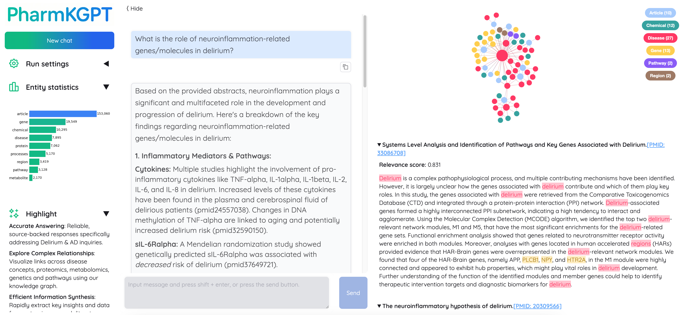

# PharmKGPT

**PharmKGPT: Accelerating Delirium and Alzheimer's Research through AI-Driven Knowledge Discovery**

To combat the issue of large language model "hallucinations" in specialized fields like medicine, this platform builds a bioinformatics-focused knowledge Q&A system for specific diseases such as Delirium and Alzheimer's Disease, ensuring responses are derived from curated scientific knowledge rather than generalized training data.



### Key Features

*   **Builds Specialized Knowledge Bases:** Automatically extracts entities (**Genes, Proteins, Pathways, Processes, Metabolites**) and their relationships from targeted literature (e.g., analyzing 153,000+ PubMed abstracts relevant to **Delirium and Alzheimer's Disease**) to create custom Knowledge Graphs (KGs) focused on these specific neurological conditions.

*   **Advanced Q&A System:** Employs an innovative hybrid Retrieval-Augmented Generation (RAG) approach, combining semantic search with Knowledge Graph queries, to provide high-precision answers to complex biological questions related to **Delirium and Alzheimer's Disease**.

*   **Visual Insights:** Presents visualized, relevant subgraph snippets alongside answers to enhance understanding and transparency of connections within the knowledge domain.

*   **Goal:** To empower researchers to efficiently explore disease mechanisms for **Delirium and Alzheimer's Disease**, identify potential drug targets, and accelerate the development of effective therapies.

## Table of Contents

1.  [Prerequisites](#1-prerequisites)
    *   [1.1 Install Ollama & Models](#11-install-ollama--models)
    *   [1.2 Download Reranker Model](#12-download-reranker-model)
    *   [1.3 Prepare Data](#13-prepare-data)
2.  [Setup & Run](#2-setup--run)
    *   [2.2 Local (Conda)](#21-local-conda)
3.  [Test](#3-test)
4.  [Data Version History](#4-data-version-history)
5.  [Tsuru Deployment](#5-tsuru-deployment)

## 1. Prerequisites

### 1.1 Install Ollama & Models

Install [ollama](https://ollama.com/).

```sh
# Pull required models
ollama pull deepseek-r1:32b
ollama pull nomic-embed-text:latest
ollama pull gemma3:27b
ollama pull Qwen2.5:0.5b

# Start the Ollama server in the background
ollama serve &
```

### 1.2 Download Reranker Model

```sh
# Download helper script (if you don't have it)
wget https://hf-mirror.com/hfd/hfd.sh
chmod a+x hfd.sh
export HF_ENDPOINT=https://hf-mirror.com
./hfd.sh BAAI/bge-reranker-large

# Extract the model archive (assuming it downloads as a tar.gz)
tar -zxvf bge-reranker-large.tar.gz
```
*Adjust paths and download methods if necessary.*

### 1.3 Prepare Data

```sh
# Extract the delirium data (latest version)
tar -zxvf Data_v7_0509.tar.gz
```
*Use `Data_v7_0509` for the full dataset*

## 2. Setup & Run

Choose either Docker or Local setup.

### 2.1 Local (Conda)

1.  **Create Environment & Install Dependencies:**
    ```sh
    conda create -n rag python=3.10 -y
    conda activate rag

    pip install -r requirements.txt

    pip install llama-index-llms-gemini==0.4.13
    pip install itext2kg==0.0.7
    ```

2.  **Configure Environment Variables:**
    Create a `.env` file in the project root with:
    ```dotenv
    # Path to the downloaded BGE reranker model directory
    RERANKER_PATH=/path/to/your/bge-reranker-large

    # Path to the root directory of the dataset you want to use
    # Example: /path/to/your/Data_v7_0509 or /path/to/your/Data_test_v4
    DATA_ROOT=/path/to/your/Data
    ```

3.  **Run the Application Servers:**
    You need to start two components: the backend API server and the web interface builder.

    *   **Start the Backend API Server:**
        ```bash
        # Runs the Flask/FastAPI application in the background, logging output to app.log
        nohup python app.py > app.log 2>&1 &
        ```
        *Note: The API server typically runs on `http://localhost:5000`.*

    *   **Start the Web Interface:**
        ```bash
        # Runs the Gradio/Streamlit web interface builder
        python builder.py
        ```
        *Note: The web interface will be accessible by default at `http://127.0.0.1:7860/`.*

4.  **Querying the System:**
    You can interact with the system in two main ways:

    *   **Via Web Interface:** Open your browser and navigate to `http://127.0.0.1:7860/`.
    *   **Via API (Terminal):** Send a POST request to the backend API endpoint:
        ```bash
        curl -X POST http://localhost:5000/api/query \
             -H "Content-Type: application/json" \
             -d '{"question": "How does kynurenic acid contribute to delirium?"}' \
             -N
        ```
    *(Optional: Mention `run.py` here if it provides a distinct, important way to interact, e.g., "For single-script execution or specific tasks, you might use `run.py` [add brief explanation if needed].")*

## Running Tests

To run the automated tests:

1.  **Ensure Test Data:** Make sure you have the test dataset (e.g., `Data_test_v4`) downloaded and extracted.
2.  **Configure Environment:** Verify that the `DATA_ROOT` variable in your `.env` file points to the *test* dataset directory (or ensure it's correctly mounted if using Docker).
3.  **Execute Pytest:**
    ```bash
    RUN_HEAVY_RAG_TESTS=1 pytest tests/test_QA.py
    ```
    The RAG integration tests are skipped by default in CI/local runs because they require `FlagEmbedding`, the KG pickles, and external LLM endpoints. Set `RUN_HEAVY_RAG_TESTS=1` when you have all prerequisites available.

## 5. Tsuru Deployment

Use the GitHub Actions workflow in `.github/workflows/deploy.yml` to build, test, and deploy automatically to the Department of Computing Tsuru cluster.

1.  **Set Repository Secrets:**  
    - `TSURU_HOST` → `https://impaas.uk` (or the custom Tsuru endpoint you were given)  
    - `TSURU_TOKEN` → the token emailed to your group. Keep this private; never commit it.

2.  **Set Repository Variable:**  
    - `TSURU_APP_NAME` → the Tsuru app name assigned to your project (e.g., `my-app-name`). We store this as a GitHub *variable* (not secret) so the workflow can resolve it without hard-coding.

3.  **Trigger the Workflow:**  
    - Push to `main` or run the workflow manually (`Actions → Deploy to Tsuru → Run workflow`). The job will:
        * check out code
        * install Python dependencies
        * run `pytest` (skips automatically if there is no tests directory)
        * bundle the repo
        * install the Tsuru CLI and log in with `TSURU_TOKEN`
        * run `tsuru app-deploy -a $TSURU_APP_NAME release.tar.gz`

4.  **Verify Deployment:**  
    - Wait ~60 seconds, then open `https://<TSURU_APP_NAME>.impaas.uk/` (or the path your FastAPI router exposes) to confirm the service is live.

If the workflow fails with authentication errors, double-check that both secrets are populated and that the token hasn’t expired. For application-specific issues (missing environment variables, data folders, etc.), replicate the failure locally with the same commands listed in the workflow logs, fix the problem, and push again.

