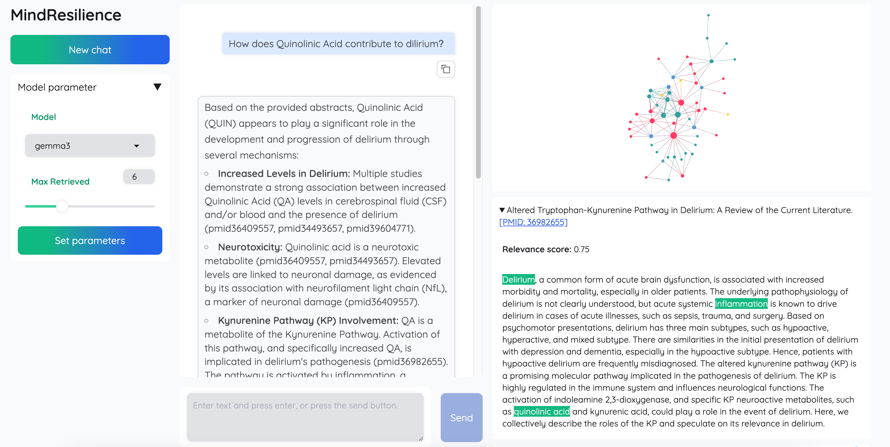

# delirium-rag

This project implements a RAG system focused on disease of delirium, using Ollama for local LLMs.



## Table of Contents

1.  [Prerequisites](#1-prerequisites)
    *   [1.1 Install Ollama & Models](#11-install-ollama--models)
    *   [1.2 Download Reranker Model](#12-download-reranker-model)
    *   [1.3 Prepare Data](#13-prepare-data)
2.  [Setup & Run](#2-setup--run)
    *   [2.1 Docker (Recommended)](#21-docker-recommended)
    *   [2.2 Local (Conda)](#22-local-conda)
3.  [Test](#3-test)
4.  [Data Version History](#4-data-version-history)

## 1. Prerequisites

### 1.1 Install Ollama & Models

Install [ollama](https://ollama.com/).

```sh
# Pull required models
ollama pull deepseek-r1:32b
ollama pull nomic-embed-text:latest
ollama pull gemma3:27b
ollama pull Qwen2.5:0.5b

# Start the Ollama server in the background
ollama serve &
```

### 1.2 Download Reranker Model

```sh
# Download helper script (if you don't have it)
wget https://hf-mirror.com/hfd/hfd.sh
chmod a+x hfd.sh
export HF_ENDPOINT=https://hf-mirror.com
./hfd.sh BAAI/bge-reranker-large

# Extract the model archive (assuming it downloads as a tar.gz)
tar -zxvf bge-reranker-large.tar.gz
```
*Adjust paths and download methods if necessary.*

### 1.3 Prepare Data

```sh
# Extract the delirium data (latest version)
tar -zxvf Data_v4.tar.gz

# Extract the test data (smaller, for quick testing)
tar -zxvf Data_test_v3.tar.gz
```
*Use `Data_v4` for the full dataset and `Data_test_v3` for testing.*

## 2. Setup & Run

Choose either Docker or Local setup.

### 2.1 Docker (Recommended)

1.  **Build Image:**
    ```sh
    docker build -t mindresilience:v1 .
    ```

2.  **Run Container (using Full Data):**
    ```sh
    # Adjust volume paths (-v) to match your local machine
    docker run -d -p 5000:5000 \
        -v "/path/to/your/Data_v4:/app/data" \
        -v "/path/to/your/bge-reranker-large:/app/bge-reranker-large" \
        -e OLLAMA_BASE_URL="http://host.docker.internal:11434" \
        --name mindresilience-app mindresilience:v1
    ```

3.  **Configure Model (Optional, sets defaults):**
    ```sh
    curl -X GET http://localhost:5000/

    curl -X POST http://localhost:5000/api/update_config \
         -H "Content-Type: application/json" \
         -d '{
               "model_type": "gemma3",
               "api_key": "NA",
               "top_k": 5,
               "hops": 1
             }'

    curl -X GET http://localhost:5001
    ```

4.  **Query:**
    ```sh
    curl -X POST http://localhost:5000/api/query \
         -H "Content-Type: application/json" \
         -d '{"question": "What are the main symptoms of delirium?"}' \
         -N
    ```

### 2.2 Local (Conda)

1.  **Create Environment & Install Dependencies:**
    ```sh
    conda create -n rag python=3.10 -y
    conda activate rag
    pip install -r requirements.txt
    ```

2.  **Configure Environment Variables:**
    Create a `.env` file in the project root with:
    ```dotenv
    # Adjust paths to match your local machine
    RERANKER_PATH=/path/to/your/bge-reranker-large
    DATA_ROOT=/path/to/your/Data_v4 
    ```

3.  **Run Application Server:**
    ```sh
    python app.py
    python builder.py # start web sever
    ```
    *(The server will run on `http://localhost:5000` by default)*

4.  **Query:**
    ```sh
    curl -X POST http://localhost:5000/api/query \
         -H "Content-Type: application/json" \
         -d '{"question": "How does kynurenic acid contribute to delirium?"}' \
         -N
    ```
    *(Use `run.py` for potential one-off script execution if needed.)*

## 3. Test

Ensure you have the test data (`Data_test_v3`) extracted and configured (e.g., in `.env` or via Docker volume).

```sh
pytest test/test_QA.py
```

## 4. Data Version History

*   **Data_v1:** Initial version for basic demo functionality.
*   **Data_v2:** Removed entries with empty abstracts.
*   **Data_v3:** Refactored data structure (led to retrieval issues, deprecated).
*   **Data_v4:** Rebuilt based on v2 structure; current primary dataset.
*   **Data_test_v3:** A smaller test dataset corresponding to the structure of Data_v4.
